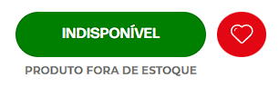
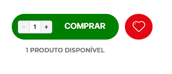
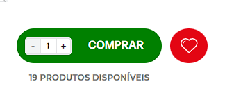

# TOTAL ITEMS AVAILABLE

<!-- DOCS-IGNORE:start -->
<!-- ALL-CONTRIBUTORS-BADGE:START - Do not remove or modify this section -->

<!-- ALL-CONTRIBUTORS-BADGE:END -->
<!-- DOCS-IGNORE:end -->

An app able to render a label containing the total number of items available in the inventory with a custom text.

This application has two responsabilities, one is get private inventory data by a backend service and the other is to provide this data to the frontend application to be rendered.

You can pass the following properties to the application:

1. **`emptyMessage`**: The message to be displayed when the total number of items in inventory is equal zero (`=== 0`).

 
_Disclaimer: This image is an example, the default value of empty message is `empty string ('')`_

2. **`message`**: The message to be displayed when the the total number of items in inventory is equal one (`=== 1`).

3. **`pluralMessage`**: The message to be displayed when the total number of items in inventory is greater than one (`> 1`).

## 🔨 Configuration

1. Add `frncubo.total-items-available` as a theme dependency in the `manifest.json` file of your vtex store template;
2. Declare the block `frncubo.total-items-available:total-items-available` on whatever block who have access to the product context in your store. (Like product pages or product cards on shelves)
3. You are ready to go!

### `total-items-available` props

| Prop name       | Type     | Description                                                                                                                                                                                                     | Default value                                |
| --------------- | -------- | --------------------------------------------------------------------------------------------------------------------------------------------------------------------------------------------------------------- | -------------------------------------------- |
| `message`       | `string` | The message that you want to display when the total of items available in inventory is equal one (== 1). Use {totalItemsAvailable} in your message to render the number of available items in inventory.        | `{totalItemsAvailable} produto disponível`   |
| `pluralMessage` | `string` | The message that you want to display when the total of items available in inventory is greater than one ( > 1). Use {totalItemsAvailable} in your message to render the number of available items in inventory. | `{totalItemsAvailable} produtos disponíveis` |
| `emptyMessage`  | `string` | The message that you want to display when the the total of items available in inventory is equal zero ( == 0). Use {totalItemsAvailable} in your message to render the number of available items in inventory.  | ``                                           |

### ⚠️ Disclaimer

The back-end service app uses an `vtex-app-key` and `vtex-app-token` to authenticate with the private inventory api of your store, make sure to create a new branch for each app you want to deploy and edit the credentials in `node/clients/totalItemsAvailable/index.ts` file.

## Customization

In order to apply CSS customizations in this and other blocks, follow the instructions given in the recipe on [Using CSS Handles for store customization](https://vtex.io/docs/recipes/style/using-css-handles-for-store-customization).

Available CSS handles for customization:

| CSS Handles |
| ----------- |
| `label`     |
| `value`     |

<!-- DOCS-IGNORE:start -->

## Contributors ✨

Thanks goes to these wonderful people:

<!-- ALL-CONTRIBUTORS-LIST:START - Do not remove or modify this section -->
matheus.bronca@frncubo.com

<!-- ALL-CONTRIBUTORS-LIST:END -->

This project follows the [all-contributors](https://github.com/all-contributors/all-contributors) specification. Contributions of any kind are welcome!

<!-- DOCS-IGNORE:end -->
